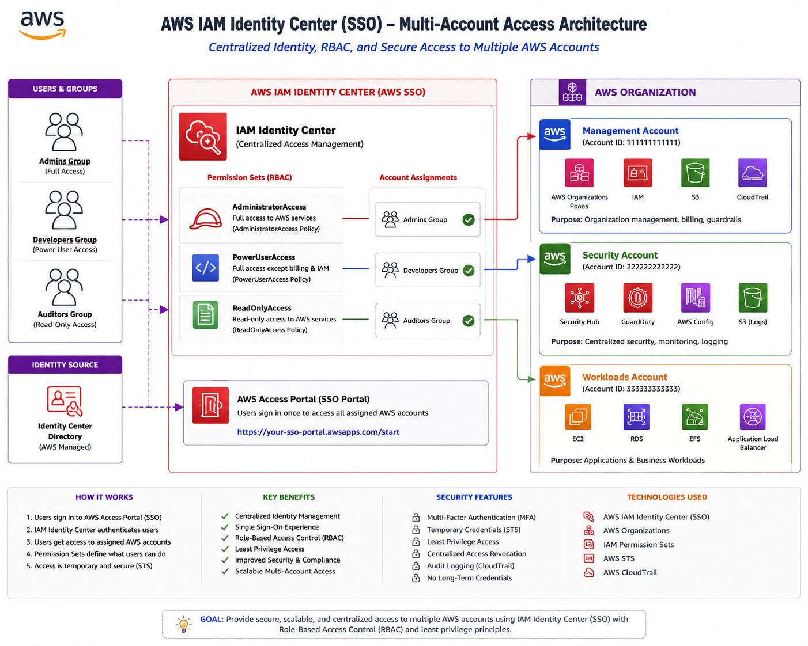

# AWS IAM Identity Center RBAC Lab

## Project Overview

This project demonstrates how to implement centralized identity and access management on AWS using AWS IAM Identity Center (formerly AWS SSO).

The goal of this lab was to simulate a real-world enterprise access management workflow where users inherit permissions through groups and permission sets instead of using long-term IAM users and static credentials.

This project focused on:

* Centralized workforce authentication
* Role-Based Access Control (RBAC)
* Permission inheritance
* Enterprise AWS governance concepts
* AWS Organizations integration
* Temporary credential-based access
* Least privilege access strategy

---
# Architecture Diagram

 

# Main Goal of the Project

Traditional beginner AWS environments often rely on:

* IAM users
* Shared credentials
* Manual permission assignments
* Long-term access keys

However, real enterprise environments typically use:

* Centralized authentication
* Single Sign-On (SSO)
* Group-based access management
* Permission inheritance
* Temporary credentials
* Federation workflows

The main objective of this project was to understand how enterprise organizations securely manage access to AWS accounts at scale.

---

# Technologies Used

| Service                 | Purpose                              |
| ----------------------- | ------------------------------------ |
| AWS IAM Identity Center | Centralized authentication and SSO   |
| AWS Organizations       | Multi-account governance foundation  |
| Permission Sets         | Centrally managed access permissions |
| AWS Access Portal       | Enterprise SSO login portal          |
| Groups                  | RBAC-based permission inheritance    |

---

# Architecture Diagram

```text
                    AWS CLOUD

┌──────────────────────────────────────────────┐
│                                              │
│            IAM IDENTITY CENTER               │
│                                              │
│  ┌────────────────────────────────────────┐  │
│  │ Users                                  │  │
│  │                                        │  │
│  │ • cloud-admin                          │  │
│  │ • developer-user                       │  │
│  │ • readonly-user                        │  │
│  └────────────────────────────────────────┘  │
│                                              │
│  ┌────────────────────────────────────────┐  │
│  │ Groups                                 │  │
│  │                                        │  │
│  │ • Admins                               │  │
│  │ • Developers                           │  │
│  │ • Auditors                             │  │
│  └────────────────────────────────────────┘  │
│                                              │
│  ┌────────────────────────────────────────┐  │
│  │ Permission Sets                        │  │
│  │                                        │  │
│  │ • AdministratorAccess                  │  │
│  │ • PowerUserAccess                      │  │
│  │ • ReadOnlyAccess                       │  │
│  └────────────────────────────────────────┘  │
│                                              │
└──────────────────────┬───────────────────────┘
                       │
                       │ SSO Login
                       ▼

            ┌──────────────────────┐
            │ AWS Access Portal    │
            │ (Single Sign-On)     │
            └──────────┬───────────┘
                       │
                       ▼

             ┌────────────────────┐
             │ AWS Account Access │
             │ Based on Role      │
             └────────────────────┘


ACCESS LEVELS

cloud-admin     -> Full Admin
developer-user  -> PowerUser
readonly-user   -> ReadOnly
```

---

# Project Workflow

The project followed this enterprise RBAC flow:

```text
User
→ Group
→ Permission Set
→ AWS Account
→ Temporary Role Access
```

This means:

* Users do not receive permissions directly
* Permissions are inherited through groups
* Permission sets define what actions users can perform
* AWS automatically creates IAM roles behind the scenes
* Temporary credentials are issued during login sessions

---

# Step 1 — Enable AWS IAM Identity Center

## Purpose

AWS IAM Identity Center was enabled to provide:

* Centralized identity management
* Enterprise SSO authentication
* Group-based access control
* Federated AWS access

## Why This Matters

Instead of creating IAM users manually in every AWS account, IAM Identity Center provides centralized authentication and scalable workforce access management.

## Actions Performed

* Opened AWS IAM Identity Center
* Enabled IAM Identity Center organization instance
* Allowed AWS Organizations integration
* Generated AWS Access Portal URL

## Screenshot

```text
screenshots/identity-center-dashboard.png
```

---

# Step 2 — Create RBAC Groups

## Purpose

Groups were created to implement Role-Based Access Control (RBAC).

Instead of assigning permissions directly to users, permissions are inherited through group membership.

## Groups Created

| Group      | Purpose                       |
| ---------- | ----------------------------- |
| Admins     | Full administrative access    |
| Developers | Limited administrative access |
| Auditors   | Read-only visibility          |

## Why We Did This

This approach scales much better in enterprise environments.

For example:

* Add user to Developers group
* User automatically inherits Developer permissions
* No need to manually configure every user individually

## Screenshot

```text
screenshots/groups-created.png
```

---

# Step 3 — Create Workforce Users

## Purpose

Users were created to simulate enterprise workforce identities.

These are NOT traditional IAM users.

They are centralized identities managed by IAM Identity Center.

## Users Created

| Username       | Group      |
| -------------- | ---------- |
| cloud-admin    | Admins     |
| developer-user | Developers |
| readonly-user  | Auditors   |

## Why This Matters

Traditional IAM users:

* Long-term credentials
* Difficult to scale
* Account-specific
* Often over-permissioned

IAM Identity Center users:

* Temporary credentials
* Centralized management
* Federated login flow
* Enterprise-friendly governance

## Screenshot

```text
screenshots/users-created.png
```

---

# Step 4 — Create Permission Sets

## Purpose

Permission sets define what actions users can perform after authenticating.

These permission sets are centrally managed and automatically provisioned into AWS accounts.

## Permission Sets Created

| Permission Set      | Purpose                             |
| ------------------- | ----------------------------------- |
| AdministratorAccess | Full AWS administrative access      |
| PowerUserAccess     | Manage most AWS services except IAM |
| ReadOnlyAccess      | View-only permissions               |

## Why We Did This

This demonstrates:

* Least privilege security
* Controlled access management
* Enterprise governance strategy
* Scalable access provisioning

## Important Concept

Behind the scenes, AWS automatically creates IAM roles for these permission sets.

Users temporarily assume these roles after logging into the AWS Access Portal.

## Screenshot

```text
screenshots/permission-sets.png
```

---

# Step 5 — Assign Groups to AWS Account

## Purpose

Groups were assigned to AWS accounts using permission sets.

This connected:

* Workforce identities
* RBAC groups
* Enterprise permissions
* AWS account access

## Assignment Mapping

| Group      | Permission Set      |
| ---------- | ------------------- |
| Admins     | AdministratorAccess |
| Developers | PowerUserAccess     |
| Auditors   | ReadOnlyAccess      |

## Why This Matters

This is where permission inheritance occurs.

Example:

```text
cloud-admin
→ member of Admins group
→ inherits AdministratorAccess
→ receives full AWS account access
```

This is the foundation of enterprise RBAC architecture.

## Screenshot

```text
screenshots/aws-account-assignments.png
```

---

# Step 6 — Test AWS Access Portal Login

## Purpose

The AWS Access Portal was tested to validate:

* SSO authentication
* Permission inheritance
* Role provisioning
* Temporary credential issuance

## Validation Performed

* Logged into AWS Access Portal
* Verified assigned AWS account visibility
* Confirmed AdministratorAccess role availability
* Confirmed centralized login workflow

## What AWS Does Behind the Scenes

When users authenticate:

* AWS issues temporary credentials
* IAM roles are assumed automatically
* Long-term credentials are avoided
* Access is scoped by assigned permission sets

## Screenshot

```text
screenshots/sso-login-portal.png
```

---

# Enterprise Concepts Learned

## Role-Based Access Control (RBAC)

Permissions are inherited through groups instead of assigned directly to users.

---

## Least Privilege Access

Users receive only the permissions required for their role.

---

## Temporary Credentials

IAM Identity Center issues temporary sessions instead of permanent access keys.

---

## Workforce Federation

Centralized authentication allows workforce users to securely access AWS resources.

---

## Centralized Governance

Access management is controlled centrally instead of individually per account.

---

# Key Takeaways

This project demonstrates how enterprise organizations:

* Avoid shared AWS accounts
* Avoid long-term IAM users
* Scale access management securely
* Centralize workforce authentication
* Enforce least privilege access
* Implement RBAC architecture

The project also provides hands-on experience with:

* AWS IAM Identity Center
* AWS Organizations
* Permission sets
* Enterprise SSO workflows
* Federated access architecture

---

# Screenshots

```text
screenshots/
├── identity-center-dashboard.png
├── users-created.png
├── groups-created.png
├── permission-sets.png
├── aws-account-assignments.png
└── sso-login-portal.png
```

---

# Cleanup Performed

To avoid leaving unnecessary access configurations:

* Removed AWS account assignments
* Deleted permission sets
* Deleted users
* Deleted groups

IAM Identity Center organization instance remained enabled because it is tied to AWS Organizations configuration.

---

# Future Improvements

Possible enterprise-level expansions for this project:

* Multi-account AWS Organization
* Organizational Units (OUs)
* Service Control Policies (SCPs)
* MFA enforcement
* Delegated administrators
* External identity provider federation
* Okta or Azure AD integration
* Cross-account governance models

---

# Repository Structure

```text
AWS-IAM-Identity-Center-RBAC-Lab/
│
├── README.md
├── architecture/
│   └── aws-iam-identity-center-architecture.png
│
├── screenshots/
│   ├── identity-center-dashboard.png
│   ├── users-created.png
│   ├── groups-created.png
│   ├── permission-sets.png
│   ├── aws-account-assignments.png
│   └── sso-login-portal.png
```

---

# Final Thoughts

This project provided hands-on experience with enterprise AWS identity and access management.

While many beginner cloud projects focus primarily on compute or networking, enterprise cloud environments rely heavily on governance, authentication, and scalable permission management.

Understanding centralized authentication, RBAC, permission inheritance, and workforce federation is a critical skill for real-world cloud engineering and cloud security roles.
